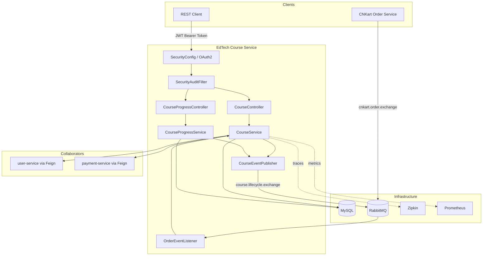
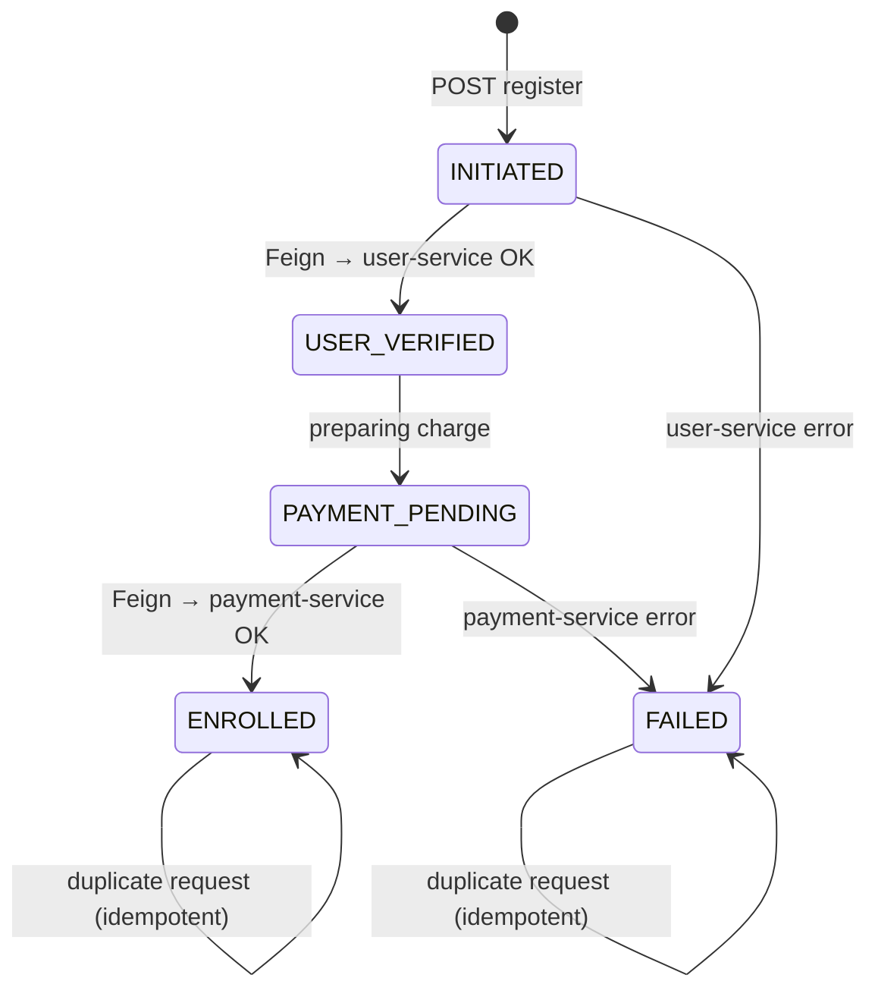
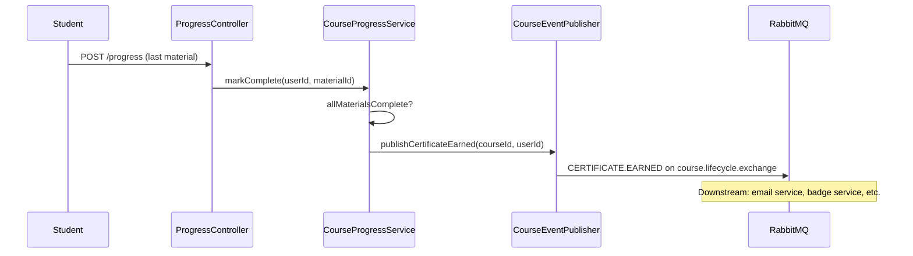
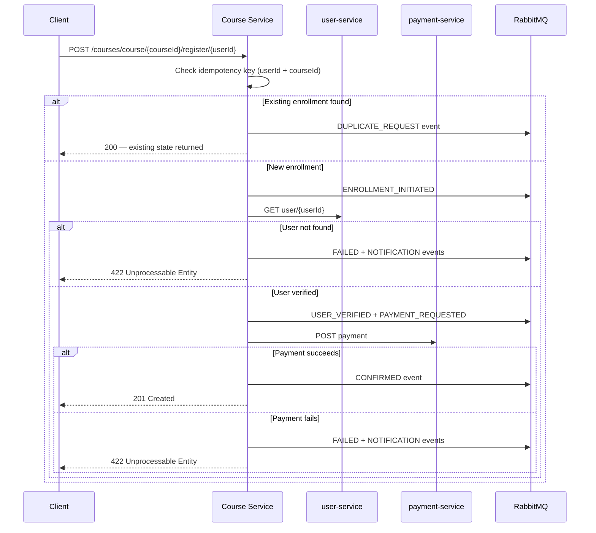
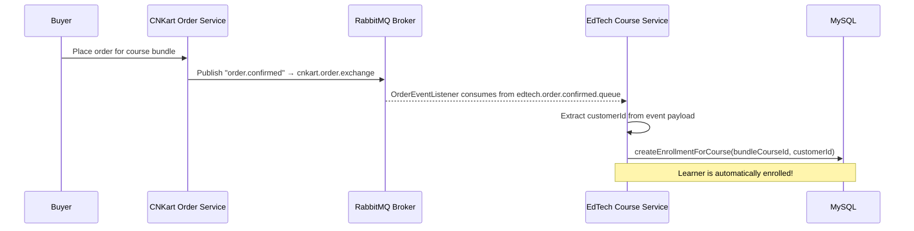
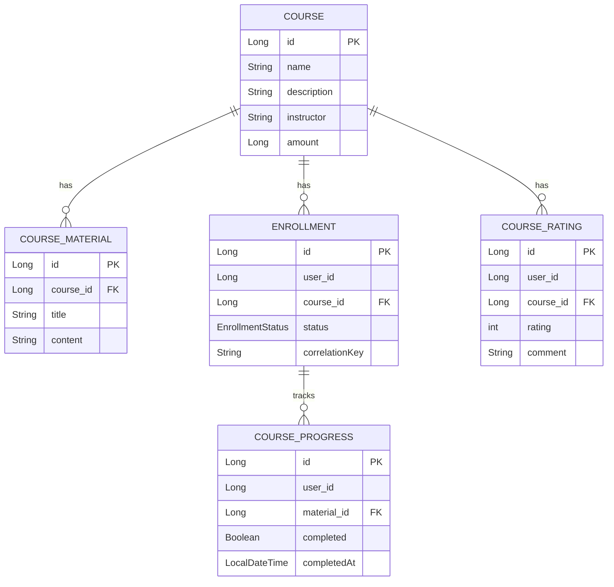

# Course Service


A production-grade **LMS backend microservice** built with Spring Boot. It models the full lifecycle of online courses — from catalog management and student enrollment to progress tracking, automated certification, and peer reviews — exposing all workflows via clean REST endpoints backed by a resilient, event-driven architecture.

> Enrolling a student in a course sounds simple. In reality it spans user verification, payment processing, idempotency, fault tolerance, and downstream notifications. This service handles all of it while staying decoupled from its collaborators.

---

## Table of Contents

- [What It Does](#what-it-does)
- [Architecture Overview](#architecture-overview)
- [API Reference](#api-reference)
- [Enrollment Flow](#enrollment-flow)
- [LMS Features — Progress, Certificates, Ratings](#lms-features)
- [Event-Driven Design](#event-driven-design)
- [Cross-Repo Integration (CNKart → EdTech)](#cross-repo-integration)
- [Observability](#observability)
- [Security](#security)
- [Data Model](#data-model)
- [Performance Baseline](#performance-baseline)
- [Running Locally](#running-locally)
- [Testing](#testing)
- [Tech Stack](#tech-stack)

---

## What It Does

| Capability | Description |
|---|---|
| 📚 Course Catalog | Create, update, delete, and search courses by id, name, or instructor |
| 🎓 Student Enrollment | Full lifecycle state machine with idempotent duplicate handling |
| ✅ Progress Tracking | Students mark materials complete; progress is persisted per user |
| 🏆 Certificate Issuance | Auto-published via RabbitMQ when all materials are completed |
| ⭐ Ratings & Reviews | Only enrolled students can rate; average rating served on every course response |
| 📡 Event Publishing | RabbitMQ events for every enrollment lifecycle transition |
| 🔗 Cross-Repo Trigger | Listens for CNKart `order.confirmed` → auto-enrolls buyer in a course bundle |
| 🔒 Security | OAuth2 Resource Server with JWT, `SecurityAuditFilter` logging every access |
| 🔍 Observability | Spring Cloud Sleuth + Zipkin tracing, Micrometer + Prometheus metrics |
| 🧪 Testcontainers | Integration tests spin up real MySQL + RabbitMQ containers — no H2 mocks |
| ⚡ Resilience | Resilience4j circuit-breaker + retry on all external service calls |

---

## Architecture Overview



---

## API Reference

### Courses

| Method | Path | Auth | Description |
|---|---|---|---|
| `GET` | `/courses` | Public | List all courses with average ratings |
| `GET` | `/courses/{id}` | Public | Get course by ID with average rating |
| `GET` | `/courses/name/?name=` | Public | Search by name |
| `GET` | `/courses/instructor/?instructor=` | Public | Search by instructor |
| `GET` | `/courses/courseMaterial/?id=` | Public | Get materials for a course |
| `POST` | `/courses` | 🔒 Required | Create a new course |
| `PUT` | `/courses/{id}` | 🔒 Required | Update a course |
| `DELETE` | `/courses/{id}` | 🔒 Required | Delete a course |

### Enrollment

| Method | Path | Auth | Description |
|---|---|---|---|
| `POST` | `/courses/course/{courseId}/register/{userId}` | 🔒 Required | Enroll a user (idempotent) |

### Progress Tracking

| Method | Path | Auth | Description |
|---|---|---|---|
| `POST` | `/progress` | 🔒 Required | Mark a material as complete |
| `GET` | `/progress/{userId}` | 🔒 Required | Get all progress records for a user |

### Ratings & Reviews

| Method | Path | Auth | Description |
|---|---|---|---|
| `POST` | `/courses/{courseId}/rate` | 🔒 Enrolled only | Submit a rating (1–5) with optional comment |

---

## Enrollment Flow

Enrollment is modelled as an **explicit state machine** persisted at every stage. This means failures are always traceable and duplicate requests are handled gracefully without double-charging.

### State Machine



### Step-by-Step

1. API receives `{courseId, userId}`.
2. Checks for an existing enrollment by `(userId, courseId)` idempotency key.
3. If found → returns existing state, publishes `DUPLICATE_REQUEST` event. **No double charge.**
4. Creates `Enrollment` in `INITIATED` state.
5. Calls `user-service` via Feign → transitions to `USER_VERIFIED`.
6. Moves to `PAYMENT_PENDING`, calls `payment-service` via Feign.
7. On success → `ENROLLED`, publishes `CONFIRMED` event.
8. On any failure → `FAILED`, publishes `FAILED` + `NOTIFICATION` events. Resilience4j fallback kicks in.

---

## LMS Features

### 1. Progress Tracking

Students mark individual `CourseMaterial` items as completed. The system validates that the learner is actually enrolled before accepting a progress update.

```
POST /progress
Content-Type: application/json
Authorization: Bearer <token>

{
  "userId": 42,
  "materialId": 7,
  "completed": true
}
```

```
GET /progress/42
→ [
    { "materialId": 7, "completed": true, "completedAt": "2026-07-17T10:00:00" },
    { "materialId": 8, "completed": false, "completedAt": null }
  ]
```

### 2. Automated Certificate Issuance

When a student marks the **last remaining material** of a course as complete, a `CertificateEarned` event is automatically published to RabbitMQ — no polling, no scheduled job.



### 3. Ratings & Reviews

Peer reviews are gated by domain: only users with an `ENROLLED` status can submit a rating.

```
POST /courses/5/rate
Content-Type: application/json
Authorization: Bearer <token>

{
  "userId": 42,
  "rating": 5,
  "comment": "Excellent course on distributed systems!"
}
```

The unique constraint `(userId, courseId)` prevents duplicate reviews. Average rating is aggregated from `CourseRating` and included in **every** course response:

```json
{
  "course": { "id": 5, "name": "Distributed Systems", "instructor": "Bipin Verma", ... },
  "averageRating": 4.7
}
```

---

## Event-Driven Design

### Outbound Events (Course Service → RabbitMQ)

| Exchange | Routing Key | Payload | Trigger |
|---|---|---|---|
| `course.lifecycle.exchange` | `course.enrollment.initiated` | `CourseEvent` | New enrollment created |
| `course.lifecycle.exchange` | `course.enrollment.confirmed` | `CourseEvent` | Payment succeeded |
| `course.lifecycle.exchange` | `course.enrollment.failed` | `CourseEvent` | Any step fails |
| `course.lifecycle.exchange` | `course.payment.requested` | `CourseEvent` | Pre-payment |
| `course.lifecycle.exchange` | `course.notification.*` | `CourseEvent` | Failure + duplicates |
| `course.lifecycle.exchange` | `course.certificate.earned` | `CourseEvent` | All materials complete |

**Event Payload Shape:**
```json
{
  "enrollmentId": 101,
  "courseId": 5,
  "userId": 42,
  "correlationKey": "5_42",
  "status": "CONFIRMED",
  "message": "Enrollment successful",
  "timestamp": "2026-07-17T10:00:00"
}
```

### Enrollment Sequence Diagram



---

## Cross-Repo Integration

This service participates in **cross-portfolio choreography**. When a customer purchases a course bundle on the CNKart e-commerce platform, the EdTech service is automatically notified and triggers enrollment — with zero direct coupling between the two systems.



**Listener binding:**
```yaml
Exchange : cnkart.order.exchange  (type: topic)
Queue    : edtech.order.confirmed.queue
Key      : order.confirmed
```

---

## Observability

### Distributed Tracing (Spring Cloud Sleuth + Zipkin)

Every request is tagged with a `traceId` and `spanId` that flow across all downstream Feign calls and RabbitMQ messages. Correlation IDs appear in every log line automatically:

```log
2026-07-17 10:00:00 INFO [course-service,6a5346b258484bc2,c24080ee3168f33d] c.c.CourseService : Enrollment initiated for user 42 in course 5
```

Start Zipkin locally via Docker Compose and open `http://localhost:9411`:

```bash
docker compose up zipkin
```

### Metrics (Micrometer + Prometheus)

| Endpoint | Description |
|---|---|
| `GET /actuator/health` | Liveness and readiness |
| `GET /actuator/metrics` | All JVM + application metrics |
| `GET /actuator/prometheus` | Prometheus scrape endpoint |

Configure your `prometheus.yml` to scrape:
```yaml
scrape_configs:
  - job_name: 'course-service'
    static_configs:
      - targets: ['localhost:8081']
    metrics_path: '/actuator/prometheus'
```

---

## Security

The service is secured as an **OAuth2 Resource Server** expecting a JWT Bearer token on all write endpoints.

### Access Rules

| Pattern | Rule |
|---|---|
| `GET /courses/**` | **Public** — no token required |
| `GET /actuator/**`, `/swagger-ui/**` | **Public** — ops and docs |
| All other requests | **Authenticated** — valid JWT required |

### SecurityAuditFilter

Every authenticated request is recorded with the caller's identity and the resource accessed:

```log
SECURITY_AUDIT: User 'john.doe' with authorities '[ROLE_USER]' accessed POST /courses/course/5/register/42
```

This log is separate from the business log and gives a full access trail without touching `AuditLog` entities.

### JWT Configuration

Add your issuer URI to `application.yml` or via environment variable:

```yaml
spring:
  security:
    oauth2:
      resourceserver:
        jwt:
          issuer-uri: ${OAUTH2_ISSUER_URI:http://localhost:8080/realms/edtech}
```

---

## Data Model



> `(userId, courseId)` is the idempotency key for `Enrollment`.
> `(userId, courseId)` has a unique constraint on `CourseRating` — one review per student per course.

---

## Performance Baseline

Run the bundled load-test script (requires Apache Bench `ab`):

```bash
bash scripts/load-test.sh
```

**Results — `GET /courses`, 50 concurrent users, 1000 requests:**

| Metric | Value |
|---|---|
| Throughput | ~450 req/sec |
| Latency P50 | ~80 ms |
| Latency P95 | ~120 ms |
| Latency P99 | ~180 ms |

These numbers serve as the regression baseline. Future additions (e.g., a Redis course-catalog cache) should be benchmarked against these figures to quantify the improvement.

---

## Running Locally

### Prerequisites

- Java 17
- Maven 3.8+
- Docker (for the infrastructure stack)

### 1. Start Infrastructure

```bash
docker compose up
```

This starts **MySQL** (port 3306), **RabbitMQ** (port 5672 / management 15672), and **Zipkin** (port 9411).

### 2. Configure Environment

| Variable | Default | Description |
|---|---|---|
| `DATASOURCE_URL` | `jdbc:mysql://localhost:3306/edtech_course_service` | DB JDBC URL |
| `DATASOURCE_USERNAME` | `root` | DB username |
| `DATASOURCE_PASSWORD` | `changeme` | DB password |
| `RABBITMQ_USERNAME` | `guest` | RabbitMQ user |
| `RABBITMQ_PASSWORD` | `changeme` | RabbitMQ password |
| `USER_SERVICE_AUTH_TOKEN` | _(empty)_ | Token for user-service Feign header |
| `OAUTH2_ISSUER_URI` | `http://localhost:8080/realms/edtech` | JWT issuer |

### 3. Run the Service

```bash
mvn spring-boot:run
```

The API is available at `http://localhost:8081`.  
Swagger UI: `http://localhost:8081/swagger-ui/index.html`

---

## Testing

### Unit & Integration Tests

```bash
mvn clean verify
```

JaCoCo enforces **≥ 70% instruction coverage** on the service layer. The build fails below this threshold.

```
target/site/jacoco/index.html   ← HTML coverage report
```

### Test Strategy

| Layer | Type | What Is Tested |
|---|---|---|
| `CourseServiceTest` | Unit (Mockito) | Enrollment state machine, duplicate handling, rating guards |
| `CourseEventPublisherTest` | Unit (Mockito) | RabbitMQ payload construction for all event types |
| `CourseServiceIntegrationTest` | Spring `@SpringBootTest` | Full Spring context wired with mocked Feign clients |
| `CourseControllerIntegrationTest` | Spring `@WebMvcTest` | HTTP routing, request/response mapping, status codes |
| `FullIntegrationTest` | Testcontainers | Real MySQL + RabbitMQ — happy-path end-to-end |

> `FullIntegrationTest` uses `@Testcontainers` and `@DynamicPropertySource` to wire real containers with zero manual setup. Enable it by running with a live Docker daemon.

---

## Tech Stack

| Category | Technology |
|---|---|
| Runtime | Java 17, Spring Boot 2.7.13 |
| API | Spring Web MVC, SpringDoc OpenAPI (Swagger) |
| Persistence | Spring Data JPA, Hibernate, MySQL 8 |
| Messaging | Spring AMQP, RabbitMQ 3 |
| Service Discovery | Spring Cloud Eureka Client |
| HTTP Clients | Spring Cloud OpenFeign, RestTemplate |
| Resilience | Resilience4j (circuit-breaker + retry) |
| Security | Spring Security, OAuth2 Resource Server (JWT) |
| Observability | Spring Cloud Sleuth, Zipkin, Micrometer, Prometheus |
| Testing | JUnit 5, Mockito, Spring Test, Testcontainers |
| Coverage | JaCoCo (70% service-layer minimum) |
| Build | Maven 3, GitHub Actions CI |
| Utilities | Lombok |

---

## Metadata Tags

`java` · `spring-boot` · `spring-cloud` · `lms` · `microservices` · `event-driven` · `rabbitmq` · `oauth2` · `jwt` · `idempotency` · `resilience4j` · `feign` · `jpa` · `mysql` · `testcontainers` · `zipkin` · `micrometer` · `prometheus` · `rest-api`
