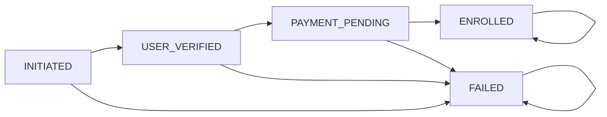

# Course Service

Spring Boot service for managing courses in an EdTech platform. The application models courses, course materials, and enrollments and exposes REST endpoints for course lookup, lifecycle management, and user enrollment.

## Overview

The service acts as a course catalog and enrollment backend for an EdTech system. Administrators can create and update courses, learners can view course details, and the platform can enroll users into courses while coordinating with user and payment services.

## What it does

- List all courses
- Retrieve courses by id, name, or instructor
- Inspect course materials for a course
- Create, update, and delete courses
- Enroll a user in a course with a persisted lifecycle state machine
- Make enrollment idempotent so duplicate requests reuse the existing enrollment
- Verify users through a user-service Feign client before enrollment
- Create a payment record through a payment-service Feign client after enrollment
- Provide a Hystrix fallback for enrollment failures
- Persist course, material, and enrollment data with JPA
- Return simple success/error messages for course operations

## Main API

- `GET /courses`
- `GET /courses/{id}`
- `GET /courses/name/?name=...`
- `GET /courses/courseMaterial/?id=...`
- `GET /courses/instructor/?instructor=...`
- `POST /courses`
- `PUT /courses/{id}`
- `DELETE /courses/{id}`
- `POST /courses/course/{courseId}/register/{userId}`

## Enrollment Flow

The v7 snapshot keeps the Feign-based integration but adds explicit enrollment states and idempotent duplicate handling so the workflow is easier to trace and reason about.

1. The API receives a course id and user id.
2. The service first checks whether an enrollment already exists for the same user and course.
3. If a record already exists, the service returns the existing enrollment state and does not create a second payment or enrollment row.
4. If no record exists, the service creates an `Enrollment` record in `INITIATED` state.
5. The service calls the user-service client to verify the user exists and advances the record to `USER_VERIFIED`.
6. The enrollment moves to `PAYMENT_PENDING` before the payment-service call.
7. If payment succeeds, the record is updated to `ENROLLED`.
8. If user verification or payment fails, the record is persisted as `FAILED` before the exception bubbles up to the Hystrix fallback.

### State Machine

## Integration Points

- `user-service` via `EdTech.Course.feign.UserService`
- `payment-service` via `EdTech.Course.feign.PaymentService`
- `RestTemplate` bean remains available for compatibility with the existing configuration

## Data Model

- `Course` represents the core catalog item
- `CourseMaterial` stores content tied to a course
- `Enrollment` links users to courses
- `EnrollmentStatus` stores lifecycle states for the enrollment workflow
- `userId + course_id` is treated as the idempotency key for enrollment requests
- `CourseDto` is used for create and update requests
- `ResponseMessage` standardizes simple API responses
- `Payment` is used when forwarding enrollment charges to the payment service

## Configuration

- Main application port: `8081`
- Datasource: `edtech_course_service`
- Hibernate is configured for `update` mode
- The service uses Spring Boot 2.7.13
- The app registers a load-balanced `RestTemplate` bean for service-to-service calls
- Enrollment requests are idempotent for the same user and course
- Enrollment records are persisted at each lifecycle stage so failures remain traceable
- Hystrix fallback support is enabled for enrollment requests

## Stack

- Java 17
- Spring Boot 2.7.13
- Spring Data JPA
- Spring JDBC
- Spring Web
- Spring Cloud LoadBalancer
- Spring Cloud OpenFeign
- Hystrix
- MySQL
- Lombok

## Notes

- The repository is intended to be extended with additional enrollment and payment workflows.
- The current service layer includes Feign-based user and payment integration.
- Generated build output is intentionally not tracked in git.
